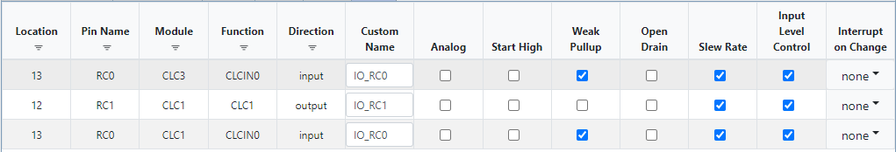

# Switch Debouncing with the PIC18F16Q40
Typically, when a switch is actuated, there is a period of time during which the electrical contacts within the switch will bounce  before settling. This causes the digital waveform for the switch to become momentarily unstable, which may cause logic that depends on the switch to malfunction.

A robust hardware-based solution to remove this bouncing can be created by using Timer 2 (TMR2) and a few of the Configurable Logic Cells (CLCs). This code example runs on the PIC18F16Q40 device to implement a software-less, hardware-based switch debouncing.

***Code Example by Khyati Mardia***

## Related Documentation

* [Audio Recording and Playback Using Direct Memory Access and Core Independent Peripherals (AN3548)](http://www.microchip.com/wwwappnotes/appnotes.aspx?appnote=en1003018)
* [Robust Debouncing with Core-Independent peripherals (AN2805)](http://ww1.microchip.com/downloads/en/DeviceDoc/AN2805-Robust-Debounc-Core-Inddep-Periph-DS00002805A.pdf)
* [Delay Block/Debouncer (AN1450)](http://www.microchip.com/wwwAppNotes/AppNotes.aspx?appnote=en559138)
* [Configurable Logic Cell Tips ’n Tricks](https://ww1.microchip.com/downloads/en/devicedoc/41631b.pdf)

## Related Examples

* [Code Free Switch Debounce using TMR2 with HLT](https://microchipdeveloper.com/xpress:code-free-switch-debounce-using-tmr2-with-hlt)

## Software Used

* [MPLAB® X IDE 5.40 or newer](http://www.microchip.com/mplab/mplab-x-ide)
* [MPLAB® XC8 2.30 or a newer compiler](http://www.microchip.com/mplab/compilers)
* [MPLAB® Code Configurator (MCC) 3.95.0 or newer](http://www.microchip.com/mplab/mplab-code-configurator)
* [MPLAB® Code Configurator (MCC) Device Libraries PIC10 / PIC12 / PIC16 / PIC18 MCUs](http://www.microchip.com/mplab/mplab-code-configurator)
* [Microchip PIC18F-Q Series Device Support (1.5.124) or newer](http://www.packs.download.microchip.com/)

## Hardware Used

[PIC18F16Q40 Curiosity Nano Evaluation Kit (EV70C97A)](https://www.microchip.com/DevelopmentTools/ProductDetails/EV70C97A)

## Table of Contents

* [Setup](#setup)
* [Clock Configuration](#clock-configuration)
* [One CLC Solution](#one-clc-solution)
* [Two CLC Solution](#two-clc-solution)
* [Three CLC Solution](#three-clc-solution)
* [Operation](#operation)
* [Summary](#summary)

## Setup

*Note: You can download a copy of this repository, unzip the files, and open the projects in MPLAB X under File → Open Project*

### Setup from Scratch

In the MPLAB X IDE, create a new project with PIC18 as the selected device family and [PIC18F16Q40](https://www.microchip.com/wwwproducts/en/PIC18F16Q40) as the selected device. If plugged in, set the Hardware Tools to the Curiosity Nano. Select the compiler as XC8 (v2.30 was used). When the project is created, click on the MPLAB Code Configuration (MCC) logo on the top menu bar to begin setting up the code. MCC is used to configure the following peripherals. Refer to the MPLAB X project for details and settings for each component.

### Clock Configuration

Configure the system clock to 1 MHz by going to *Project Resources → System → System Module*. Select HFINTOSC for Oscillator Select, set the frequency to 4 MHz, and the clock divider to 4, as shown in Figure 1.  

**Figure 1 - System Clock Settings Used**

Three possible versions of this project are provided, each using a varying number of CLCs. Any of these solutions can be used for switch debouncing, however, the more CLCs are used, the more robust the solution becomes.

1.	TMR2 and 1 CLC
2.	TMR2 and 2 CLCs
3.	TMR2 and 3 CLCs  

---

## One CLC Solution

TMR2 automates the debouncing process using the monostable mode of operation. In this mode, the 1st edge from the switch being pressed is used to start the timer. The timer ignores any subsequent edges from the button. Once the timer counter reaches a predetermined value, the timer outputs a pulse. The count required for the timer can be determined by how long the instability in the switch lasts. If this value is too short, the timer will restart before stability has been reached. If this value is too long, it will cause a delay in responding to the change.

The TMR2 output is used with a CLC that is configured as a toggle flip-flop. The CLC is in the "JK flip-flop with R" mode of operation (Figure 2) where the TMR2 output acts as the clock input with J and K both kept at logic 1. Every output pulse from TMR2 inverts the output of the JK Flip-Flop.

**Figure 2 - Logic Diagram (1 CLC Example)**

### Benefits of this Solution

The biggest benefit of this solution is the low peripheral count, only requiring a single CLC and TMR2.

### Limitations of this Solution

The biggest drawback of this solution is the lack of any glitch filtering. Once an edge on switch 0 has been detected, the timer will always provide a pulse to CLC 1 to invert the output. If this edge was caused by a momentary glitch that occurred while the timer is idle, a pulse will be sent to the flip-flop, inverting the output levels until another glitch occurs.

### Timer Configuration

On the left side of the IDE, double-click TMR2 from the Device Resources section to add it to Project Resources. Set the timer for monostable operation, with start/reset on both edges and the reset source should be set to T2INPPS. Then, select LFINTOSC as the clock source and type in 1.5ms in the Timer Period field. The timer period can be set to any value within the range as per the application requirements.

**Figure 3 - CLC Settings (1 CLC Example)**

### CLC Configuration

On the left side, double-click CLC1 from Device Resources to add it to Project Resources. Configure CLC1 as shown in Figure 4. Select "JK flip-flop with R" in the mode field and TMR2 as the clock signal to the J-K Flip-Flop register. Tie both J and K inputs of the JK Flip-Flop high by inverting the outputs of the associated OR Gates by clicking inside of the dashed box on the output.

Note: Setting every input to TMR2 will "unlock" the default CLCIN0 pin. For this code example, leaving the pin as is will not impact functionality.

**Figure 4 - CLC Settings (1 CLC Example)**

### Pin Configuration

Navigate to the Pin Manager and connect on-board switch, located on pin RC0, to the Timer input and connect the CLC1 output to the on-board LED, located on pin RC1, as shown in the Figure 5.

**Figure 5 - Pin Assignments (1 CLC Example)**

Go to the Pin Module under Project Resources, and click on the check box for the Weak Pull-Up (WPU) on pin RC0 as shown in Figure 6. This enables the internal weak pull-up resistors, which prevents the input from floating when the button is not pressed.

**Figure 6 - Pin Settings Used (1 CLC Example)**

---

## Two CLC Solution

Figure 7 shows the logic diagram of the 2 CLC solution.

Logically, 2 D flip-flops are created by CLC3 and CLC1. The input signal of CLC3 is ANDed with the CLC3 output to become the input to CLC1. The TMR2 signal serves as a very slow clock for all of the CLCs.

**Figure 7 - Logic Diagram (2 CLC Example)**

### Benefits of this Solution

This version of the solution adds a simple glitch filter to the debouncing logic. In this solution, the debouncing logic operates slightly differently than the 1 CLC solution. TMR2 is used to generate a low frequency clock signal (period of 1.5ms) into the two flip-flops. This example uses the two flip-flops to block fast-changing logic.  

If an active-high glitch occurs right before CLC3 latches (starting at 0), the AND gate would block it from propagating into CLC1. To latch into CLC1, the (active-high) glitch would have to latch into CLC3, then become/remain active during the next rising edge from TMR2 to successfully propagate through the AND gate and latch into CLC1.

### Limitations of this Solution

Besides the higher peripheral usage, the other downside of this example is a limitation of this glitch filter. Consider the case of an active-low glitch (CLC3 Out = 1). The active-low signal bypasses CLC3 by forcing the AND gate to 0. CLC1 can latch the glitch and produce the wrong output, however it will recover within 2 clock cycles after the glitch has passed.

### Timer Configuration

On the left side, double-click TMR2 from Device Resources to add them to Project Resources. Configure TMR2 to get a 1.5ms Timer Period as shown in Figure 8. Set the operating mode of TMR2 to "Roll over pulse" and the Start/Reset option to "Software control". Select LFINTOSC as the clock source and type in 1.5ms in the Timer Period field. Other timer periods may function correctly, however these should be evaluated on a case-by-case basis.

**Figure 8 - Timer Settings (2 CLC Example)**

### CLC Configuration

On the left side of the IDE, double-click CLC3 and CLC1 from Device Resources to add them to Project Resources. Configure CLC1 as shown in Figure 9 and CLC3 as shown in Figure 10.

#### CLC1 Configuration

Select `2-input D flip-flop with R` in the Mode field, TMR2 as the clock signal to the D Flip-Flop register, and CLCIN0 as the input signal. Connect these two signals to the CLC logic gates 1 and 2 as shown in Figure 9.

**Figure 9 - CLC1 Settings (2 CLC Example)**

#### CLC3 Configuration

Select the `2-input D flip-flop with R` in the Mode field, TMR2 as the clock signal to the D Flip-Flop register, and CLC3_OUT (the output signal of CLC3). There is no logic AND available in this configuration, however by using [De Morgan's law](https://en.wikipedia.org/wiki/De_Morgan%27s_laws), logic AND can be rewritten as:

( A * B ) = ~ ( ( ~ A) + (~ B))

To implement this, invert CLCIN0 and CLC3_OUT into the OR gate, then invert the output of this gate (see Figure 10 for a visual representation). Connect the TMR2 signal to logic gate 1 to supply the clock signal.

**Figure 10 - CLC3 Settings (2 CLC Example)**

### Pin Configuration

Navigate to the Pin Manager and connect on-board switch, located on pin RC0, to the CLCIN0 input and connect the CLC1 output to the on-board LED, located on pin RC1, as shown in the Figure 11.

**Figure 11 - Pin Assignments (2 CLC Example)**

Then, go to the Pin Module and click on the check box to enable the WPU for RC0 as shown in Figure 12.

**Figure 12 - Pin Settings Used (2 CLC Example)**

---

## Three CLC Solution

The logic diagram of the 3-CLCs solution is shown in Figure 13. The 1st CLC (CLC3) has the same input as before (previously shown in Figure 7). The 3rd CLC (CLC2) is chosen as 4-input AND logic. The input signal and the first two CLC output signals are not ORed (equivalent to NAND) and then NANDed together to the logic function:

CLC2_OUT = (SW0 * CLC3_OUT) + (SW0 * CLC1_OUT) + (CLC3_OUT * CLC1_OUT))

*Note: SW0 is CLCIN0*

At every rising edge of the clock, the following occur:

CLC2_OUT → CLC1_OUT (output)   
SW0 → CLC3_OUT

The table below shows the output of the logic function.

*Note: LED output on Curiosity Nano is Active LOW.*

| SW0 | CLC3_OUT | CLC1_OUT | Next CLC1 Value (and Debounced Output)
|---- | -------- | -------- | --------
| 0   | 0        | 0        | 0        
| 0   | 0        | 1        | 0        
| 0   | 1        | 0        | 0        
| 0   | 1        | 1        | 1   
| 1   | 0        | 0        | 0        
| 1   | 0        | 1        | 1        
| 1   | 1        | 0        | 1        
| 1   | 1        | 1        | 1      

**Table 1 - Output of CLC2**     

**Figure 13 - Logic Diagram of the 3 CLC Solution**

### Benefits of this Solution

This solution is a much more advanced glitch filter than the 2 CLC example. This solution will only output "1" when 2 of the 3 inputs are 1. The 3 signal sources are:

* Input Pin (SW0)
* Latched Input Value (CLC3_OUT)
* Current Output Value (CLC1_OUT)

A glitch or bounce on the input pin will not affect the output immediately because the latched value and current state are unaffected. A glitch that occurs when CLC3 is latching is also unlikely to affect the logic. CLC3 would have a latched value that is incorrect, however the glitch would need to be active when the next rising edge occurs in order to latch the value into CLC 1.  

### Limitations of this Solution

The biggest limitation of this solution is the peripheral cost. This solution uses 3 CLCs and TMR2. In the PIC18-Q40 family, there are only 4 CLCs on the device. It may be possible to remove TMR2 from this example by using another peripheral or clock source.

### Timer Configuration

On the left side, double-click TMR2 from Device Resources to include it in Project Resources. Configure TMR2 to get a 1.5ms Timer Period as shown in Figure 14. Select LFINTOSC as the clock source and type in 1.5ms in the Timer Period field. Other timer periods may function correctly, however these should be evaluated on a case-by-case basis.

**Figure 14 - Timer 2 Settings (3 CLC Example)**

### CLC Configuration

On the left side, double-click CLC1, CLC2 and CLC3 from the Device Resources section to add them to Project Resources. Configure CLC1, CLC2 and CLC3 as shown in Figure 15, Figure 16 and Figure 17 respectively.

#### CLC 1 Configuration

Select `2-input D flip-flop with R` in the Mode field, TMR2 as the clock signal to the D Flip-Flop register, and CLC2_OUT (the output signal of CLC2) as an input signal to CLC1. Connect the TMR2 signal to the CLC logic gate 1 as shown in Figure 15.

**Figure 15 - CLC 1 Settings (3 CLC Example)**

#### CLC 2 Configuration

Configure CLC2 as shown in Figure 17. Select `4-input AND` in the Mode field. Select the three input signals: CLCIN0, CLC3_OUT, and CLC1_OUT. Invert the output of unused logic gate 1 to ensure the AND gate can function properly.

 Make sure logic gates 2, 3, and 4 have the correct two inputs connected and properly inverted. This CLC functions to output 0 only if all 3 inputs are at a logic 1 - if any 2 pairs of values are at a logic 1, then an OR gate turns off, which shuts off the AND gate, which has an inverted output.

 

**Figure 16 - CLC 2 Settings (3 CLC Example)**

#### CLC 3 Configuration

Select `2-input D flip-flop with R` in the Mode field, TMR2 as the clock signal to the D Flip-Flop register, and CLCIN0 as the input signal. Connect these two signals to the CLC logic gates 1 and 2 respectively as shown in Figure 17.

**Figure 17 - CLC 3 Settings (3 CLC Example)**

### Pin Configuration

Navigate to the Pin Manager and connect on-board switch, located on pin RC0, to the CLCIN0 input and connect the CLC1 output to the on-board LED, located on pin RC1, as shown in the Figure 18.

**Figure 18 - Pin Assignments (3 CLC Example)**

Then, go to the Pin Module, click on the checkbox to enable the WPU for RC0 as shown in Figure 20.

**Figure 19 - Pin Settings Used (3 CLC Example)**

## Operation

For all examples, the LED output on RC0 will be on while the pushbutton on RC0 is held down.

## Summary
TMR2 can be combined with CLCs for excellent code-free switch debouncing . Adding more CLCs further improves the noise rejection on the input signal, which reduces the possibility for unexpected debouncing to be recognized. The appropriate solution can be chosen based on the robustness required.
