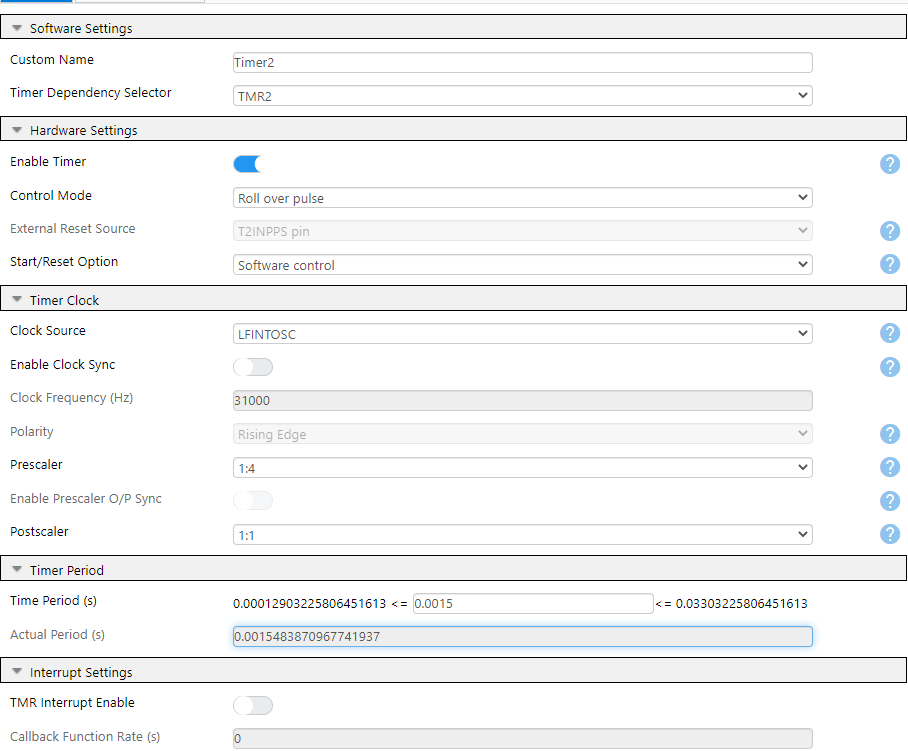
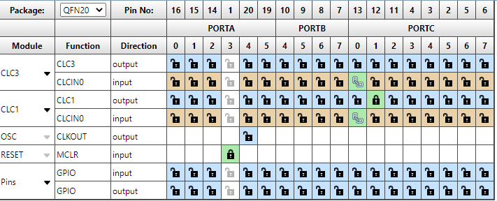
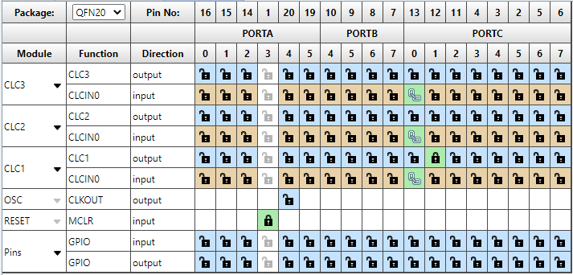

# Switch Debouncing with the PIC18F16Q40
Typically, when a switch is activated, there is some period where the electrical contacts within the switch may bounce before settling. A robust solution can be created by using an internal timer and some of the Configurable Logic Cells (CLCs) to filter out the various kinds of noise generated by the switch. This code example uses the PIC18F16Q40 which has 4 CLCs available. This application demonstrates the use of Timer 2 (TMR2) and CLCs for software-less, hardware-based switch debouncing.

***Code Example by Khyati Mardia***

## Related Documentation

* [Audio Recording and Playback Using Direct Memory Access and Core Independent Peripherals (AN3548)](http://www.microchip.com/wwwappnotes/appnotes.aspx?appnote=en1003018)
* [Robust Debouncing with Core-Independent peripherals (AN2805)](http://ww1.microchip.com/downloads/en/DeviceDoc/AN2805-Robust-Debounc-Core-Inddep-Periph-DS00002805A.pdf)
* [Delay Block/Debouncer (AN1450)](http://www.microchip.com/wwwAppNotes/AppNotes.aspx?appnote=en559138)
* [Configurable Logic Cell Tips ’n Tricks](https://ww1.microchip.com/downloads/en/devicedoc/41631b.pdf)

## Related Examples

* [Code Free Switch Debounce using TMR2 with HLT](https://microchipdeveloper.com/xpress:code-free-switch-debounce-using-tmr2-with-hlt)

## Software Used

* MPLAB® X IDE 5.40 or newer (microchip.com/mplab/mplab-x-ide)
* MPLAB® XC8 2.20 or a newer compiler (microchip.com/mplab/compilers)
* MPLAB® Code Configurator (MCC) 3.95.0 or newer (microchip.com/mplab/mplab-code-configurator)
* MPLAB® Code Configurator (MCC) Device Libraries PIC10 / PIC12 / PIC16 / PIC18 MCUs (microchip.com/mplab/mplab-code-configurator)
* Microchip PIC18F-Q Series Device Support (1.5.124) or newer (packs.download.microchip.com/)

## Hardware Used

[PIC18F16Q40 Curiosity Nano Evaluation Kit (EV70C97A)](https://www.microchip.com/DevelopmentTools/ProductDetails/EV70C97A)

## Table of Contents

* [Setup](#setup)
* [Clock Configuration](#)
* [One CLC Solution](#one-clc-solution)
* [Two CLC Solution](#two-clc-solution)
* [Three CLC Solution](#three-clc-solution)
* [Operation](#operation)
* [Summary](#summary)

## Setup

In MPLAB X IDE, create a new project with PIC18 as the selected Device Family and PIC18F16Q40 as the Device. Select Hardware Tools as Curiosity in Microchip Starter Kits. Select Compiler as XC8 (v2.0 was used). When the project is created, click on the MCC logo on the top menu bar for code configuration. MCC is used to configure the following peripherals. Refer to the MPLAB X project for details and settings for each component.

### Clock Configuration

Configure the system clock to 1 MHz under *Project Resource → System → System Module*. Select HFINTOSC for the Oscillator Select option as highlighted in the red circle in Figure 1. Make sure 4 is selected in the Clock Divider option. This will configure the system clock to 1 MHz.

  
**Figure 1**

Three possible solutions are provided, each using a varying number of CLCs. Any of these solutions can be used for switch debouncing, however, the more CLCs are used, the more robust the solution becomes.

1.	TMR2 and 1 CLC
2.	TMR2 and 2 CLCs
3.	TMR2 and 3 CLCs  

## One CLC Solution

TMR2 automates the debouncing process using the monostable mode of operation. In this mode, the 1st logic edge from the switch being pressed is used to start the timer. The timer ignores any subsequent edges from the button. Once the timer counter reaches a predetermined value, the timer outputs a pulse.

The TMR2 output is used with a CLC as a toggle flip-flop in "JK flip-flop with R" mode of operation (Figure 2) where the TMR2 output acts as the clock input with J and K both kept at logic 1. Every output pulse from TMR2 toggles the output of the JK Flip-Flop when the switch is pressed or released.

  
**Figure 2**

### Timer Configuration

On the left side, double-click TMR2 from the Device Resources section to add it to the Project Resources. Set the timer for monostable operation, with start/reset on both edges and the reset source should be set to T2INPPS. Then, select LFINTOSC as the clock source and type in 1.5ms in the Timer Period field. The timer period can be set to any value within the range as per the application requirements.

  
**Figure 3**

### CLC Configuration

On the left side, double-click CLC1 from Device Resources to add it to the Project Resources. Configure CLC1 as shown in Figure 4. Select "JK flip-flop with R" in the mode field and TMR2 as the clock signal to the J-K Flip-Flop register. Tie both J and K inputs of the JK Flip-Flop high by inverting the outputs of the associated OR Gates by clicking inside of the dashed box on the output.

Note: Setting every input to TMR2 will "unlock" the default CLCIN0 pin. For this code example, leaving the pin as is will not impact functionality.

  
**Figure 4**

### Pin Configuration

Navigate to the Pin Manager and connect on-board switch, located on pin RC0, to the Timer input and connect the CLC1 output to the on-board LED, located on pin RC1, as shown in the Figure 5.

  
**Figure 5**

Go to the Pin Module under Project Resources, and click on the check box for the Weak Pull-Up (WPU) on pin RC0 as shown in Figure 6. This enables the internal weak pull-up resistors, which prevents the input from floating when the button is not pressed.

  
**Figure 6**

## Two CLC Solution

Figure 7 shows the logic diagram of the 2 CLC solution.

Logically, 2 D flip-flops are created by the CLC3 and CLC1. The input signal of CLC3 is ANDed with the CLC3 output signal to become the input to CLC1. The TMR2 signal serves as clock for all of the CLCs.

  
**Figure 7**

### Timer Configuration

On the left side, double-click TMR2 from Device Resources to add them to Project Resources. Configure TMR2 to get a 1.5ms Timer Period as shown in Figure 8. Set the operating mode of TMR2 to "Roll over pulse" and the Start/Reset option to "Software control". Select LFINTOSC as the clock source and type in 1.5ms in the Timer Period field. The timer period can be set to any value within the range, however 1.5ms works well in this example.

  
**Figure 8**

### CLC Configuration

On the left side, double-click CLC3 and CLC1 from the Device Resources section to add them to Project Resource section. Configure CLC1 as shown in Figure 9 and CLC3 as shown in Figure 10.

#### CLC1 Configuration

Select `2-input D flip-flop with R` in the Mode field, TMR2 as the clock signal to the D Flip-Flop register, and CLCIN0 as the input signal. Connect these two signals to the CLC logic gates 1 and 2 as shown in Figure 9.

  
**Figure 9**

#### CLC3 Configuration

Select the `2-input D flip-flop with R` in the Mode field, TMR2 as the clock signal to the D Flip-Flop register, and CLC3 OUT (the output signal of CLC3). There is no logic AND available in this configuration, however by using [De Morgan's law](https://en.wikipedia.org/wiki/De_Morgan%27s_laws), logic AND can be rewritten as:

( A * B ) = ~ ( ( ~ A) + (~ B))

To implement this, invert CLCIN0 and CLC3 OUT into the OR gate, then invert the output (see Figure 10 for a visual representation). Connect the TMR2 signal to the CLC logic gate 1 to supply the clock signal.

  
**Figure 10**

### Pin Configuration

Navigate to the Pin Manager and connect on-board switch, located on pin RC0, to the CLCIN0 input and connect the CLC1 output to the on-board LED, located on pin RC1, as shown in the Figure 11.

  
**Figure 11**

Then, go to the Pin Module and click on the check box to enable the WPU for RC0 as shown in Figure 12.

  
**Figure 12**

## Three CLC Solution

The logic diagram of the 3-CLCs solution is shown in Figure 13. The 1st CLC (CLC3) has the same input as before (Figure 7). The 3rd CLC (CLC2) is chosen as 4-input AND logic. The input signal and the first two CLC output signals are paired ANDed and then ORed together as:

CLC2_OUT = CLCIN0 * CLC3_OUT + CLCIN0 * CLC1_OUT + CLC3_OUT * CLC1_OUT

The output signal of the 3rd CLC provides the input signal to the 2nd CLC (CLC1). The 2nd CLC outputs the same debouncing signal as before. The 3rd CLC ensures no single LOW value on any of the three inputs will cause the debouncing output to go LOW.

  
**Figure 13**

### Timer Configuration

On the left side, double-click TMR2 from Device Resources to include it in Project Resources. Configure TMR2 to get a 1.5ms Timer Period as shown in Figure 14. Select LFINTOSC as the clock source and type in 1.5ms in the Timer Period field. The timer period can be set to any value within the range, however 1.5ms works well in this application.

  
**Figure 14**

### CLC Configuration

On the left side, double-click CLC3, CLC2 and CLC1 from the Device Resources section to add them to Project Resources. Configure CLC3, CLC2 and CLC1 as shown in Figure 15, Figure 16 and Figure 17 respectively.

#### CLC 1 Configuration

Select 2-input D flip-flop with R in the Mode field. Select TMR2 as the clock signal to the D Flip-Flop register. Select CLC2_OUT (the output signal of CLC2) as an input signal to CLC1. Connect the TMR2 signal to the CLC logic gate 1 as shown in Figure 15.

  
**Figure 15**

#### CLC 2 Configuration

Configure CLC2 as shown in Figure 17. Select `4-input AND` in the Mode field. Select the three input signals: CLCIN0, CLC3_OUT, and CLC1_OUT. Invert the output of unused logic gate 1 to ensure the AND gate can function properly.

 Make sure logic gates 2, 3, and 4 have the correct two inputs connected and properly inverted. This CLC functions to output 0 only if all 3 inputs are at a logic 1 - if any 2 pairs of values are at a logic 1, then an OR gate turns off, which shuts off the AND gate, which is inverted.

  
**Figure 16**

#### CLC 3 Configuration

Select `2-input D flip-flop with R` in the Mode field, TMR2 as the clock signal to the D Flip-Flop register, and CLCIN0 as the input signal. Connect these two signals to the CLC logic gates 1 and 2 respectively as shown in Figure 17.

  
**Figure 17**

### Pin Configuration

Navigate to the Pin Manager and connect on-board switch, located on pin RC0, to the CLCIN0 input and connect the CLC1 output to the on-board LED, located on pin RC1, as shown in the Figure 18.

  
**Figure 18**

Then, go to the Pin Module, click on the check box to enable the WPU for RC0 as shown in Figure 20.

  
**Figure 19**

## Operation

For all examples, the LED output on RC0 will turn on (or off) while the pushbutton on RC0 is held down.

## Summary
TMR2 can be combined with CLCs for an excellent code-free switch debouncing . Introducing another stage of CLCs further improves the noise rejection  on the input signal, which reduces the possibility for unexpected debouncing to be recognized. The appropriate solution can be chosen based on the robustness required.
